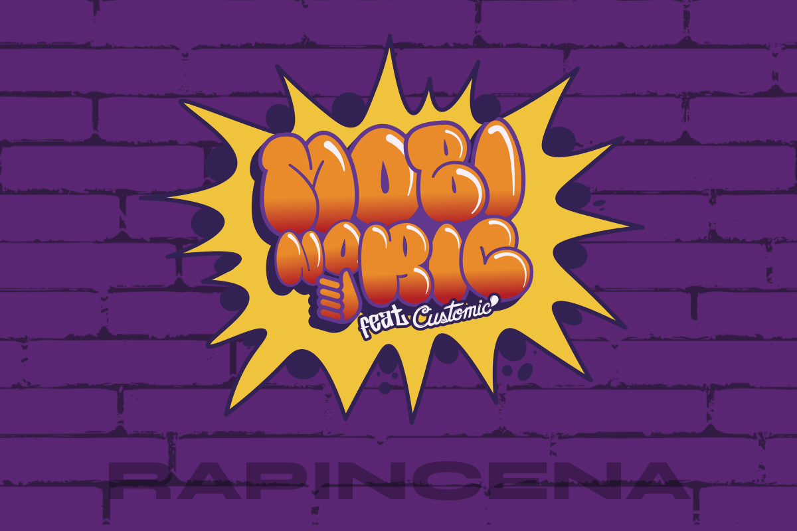
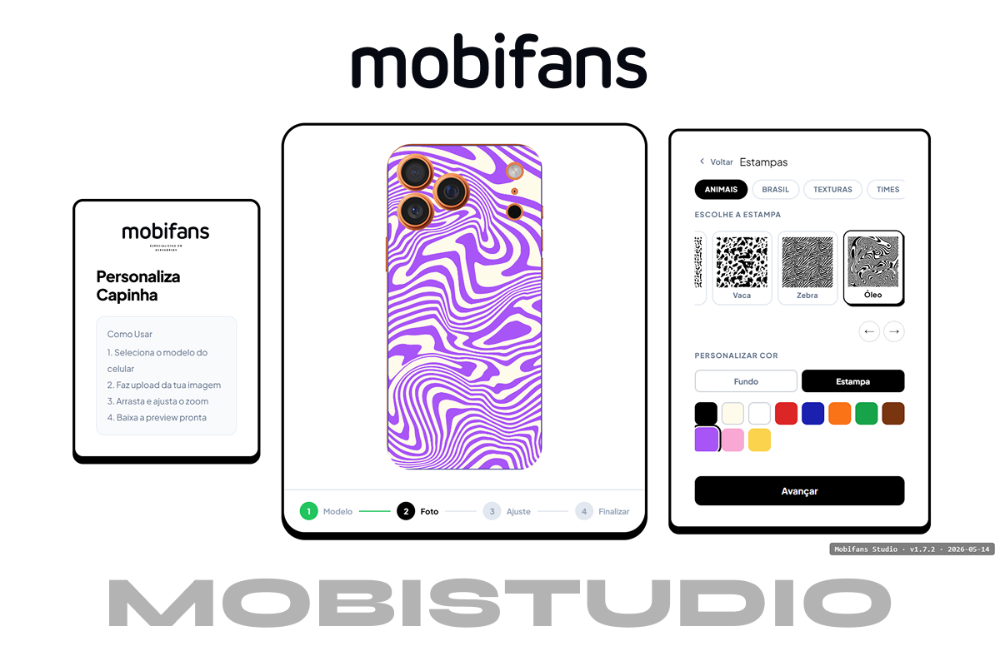

# Plano de Ação SEO — filipeduarte.netlify.app
**Data:** 2026-05-20

---

## CRÍTICO — Fazer imediatamente (< 1 hora total)

### C1. Criar `robots.txt`
**Ficheiro:** `robots.txt` (raiz do projeto)
```
User-agent: *
Allow: /
Sitemap: https://filipeduarte.netlify.app/sitemap.xml
```

---

### C2. Criar `sitemap.xml`
**Ficheiro:** `sitemap.xml` (raiz do projeto)
```xml
<?xml version="1.0" encoding="UTF-8"?>
<urlset xmlns="http://www.sitemaps.org/schemas/sitemap/0.9">
  <url>
    <loc>https://filipeduarte.netlify.app/</loc>
    <lastmod>2026-05-20</lastmod>
    <changefreq>monthly</changefreq>
    <priority>1.0</priority>
  </url>
</urlset>
```

---

### C3. Adicionar canonical + Open Graph completo + Twitter Card
**Ficheiro:** `index.html` — dentro do `<head>`, após a meta description existente

```html
<!-- Canonical -->
<link rel="canonical" href="https://filipeduarte.netlify.app/" />

<!-- Open Graph — completar os que faltam -->
<meta property="og:url" content="https://filipeduarte.netlify.app/" />
<meta property="og:locale" content="pt_BR" />
<meta property="og:image" content="https://filipeduarte.netlify.app/img/og-image.jpg" />
<meta property="og:image:width" content="1200" />
<meta property="og:image:height" content="630" />

<!-- Twitter Card -->
<meta name="twitter:card" content="summary_large_image" />
<meta name="twitter:title" content="Filipe Duarte - Produtor Multimídia" />
<meta name="twitter:description" content="Unindo Design, Código e IA Generativa. Adobe Certified. Porto Alegre." />
<meta name="twitter:image" content="https://filipeduarte.netlify.app/img/og-image.jpg" />
```

**Nota:** Criar uma imagem `og-image.jpg` (1200×630px) com o nome, cargo e um visual do portfólio. Esta imagem aparece quando o link é partilhado no LinkedIn, WhatsApp, X, etc.

---

### C4. Adicionar JSON-LD Person Schema
**Ficheiro:** `index.html` — antes de `</head>`

```html
<script type="application/ld+json">
{
  "@context": "https://schema.org",
  "@type": "Person",
  "name": "Filipe Velasco Duarte Delfino",
  "alternateName": "Filipe Duarte",
  "jobTitle": "Produtor Multimídia",
  "description": "Designer Multimídia com 4+ anos de experiência em identidade visual, produção gráfica e audiovisual. Adobe Certified. Porto Alegre, RS.",
  "url": "https://filipeduarte.netlify.app/",
  "email": "mailto:filipe.velascoduarte@gmail.com",
  "telephone": "+55-51-9-9605-1030",
  "image": "https://filipeduarte.netlify.app/img/og-image.jpg",
  "address": {
    "@type": "PostalAddress",
    "addressLocality": "Gravataí",
    "addressRegion": "Rio Grande do Sul",
    "addressCountry": "BR"
  },
  "sameAs": [
    "https://www.linkedin.com/in/filipevelascoduarte",
    "https://www.behance.net/filipevelascoduarte"
  ],
  "knowsAbout": [
    "Design Gráfico",
    "Produção Multimídia",
    "UX/UI Design",
    "Adobe Photoshop",
    "Adobe Illustrator",
    "Figma",
    "Blender",
    "JavaScript",
    "Canvas API",
    "IA Generativa"
  ],
  "hasCredential": [
    {
      "@type": "EducationalOccupationalCredential",
      "name": "Adobe Certified Professional — Visual Design",
      "credentialCategory": "Certification"
    },
    {
      "@type": "EducationalOccupationalCredential",
      "name": "Claude 101 — Anthropic",
      "credentialCategory": "Certification"
    }
  ],
  "alumniOf": {
    "@type": "EducationalOrganization",
    "name": "Centro Universitário Senac",
    "address": {
      "@type": "PostalAddress",
      "addressLocality": "Porto Alegre",
      "addressRegion": "RS",
      "addressCountry": "BR"
    }
  }
}
</script>

<script type="application/ld+json">
{
  "@context": "https://schema.org",
  "@type": "WebSite",
  "name": "Filipe Duarte — Portfólio",
  "url": "https://filipeduarte.netlify.app/",
  "author": {
    "@type": "Person",
    "name": "Filipe Duarte"
  },
  "inLanguage": "pt-BR"
}
</script>
```

---

## ALTO — Fazer esta semana

### A1. Criar imagem og-image.jpg (1200×630px)
- Usar Figma ou Photoshop para criar uma imagem de partilha social
- Incluir: nome, cargo, localização, fundo coerente com o design do portfólio
- Guardar em `img/og-image.jpg`
- **Impacto:** Toda partilha no LinkedIn/WhatsApp/X passa a ter preview visual

### A2. Adicionar `loading="lazy"` nas imagens abaixo da fold
**Ficheiro:** `index.html`

Adicionar `loading="lazy"` a todas as imagens exceto a primeira visível:
```html
<!-- Manter sem lazy (above the fold): Banner_MobiStudio_Portfolio.jpg -->
<!-- Adicionar loading="lazy" a partir do segundo projeto: -->


<!-- ... etc. para todas as restantes -->
```

### A3. Adicionar `width` e `height` nas imagens
Previne CLS (Cumulative Layout Shift). Exemplo:
```html

```
Ajustar os valores às dimensões reais de cada imagem.

### A4. Converter `mobiStudio Banner.png` para WebP
PNG é significativamente maior que WebP. Converter e atualizar a referência no HTML:
```html

```

### A5. Melhorar o H1 para incluir o nome
**Atual:**
```html
<h1 class="hero__headline" id="hero-title">
  PRODUTOR <em>Multimídia</em>
</h1>
```
**Sugestão:**
```html
<h1 class="hero__headline" id="hero-title">
  Filipe Duarte —<br>PRODUTOR <em>Multimídia</em>
</h1>
```
Ou manter o visual atual mas adicionar um `<span class="sr-only">Filipe Duarte, </span>` antes para leitores de ecrã e indexação.

---

## MÉDIO — Fazer este mês

### M1. Criar `llms.txt` para AI Search Readiness
**Ficheiro:** `llms.txt` (raiz do projeto)
```markdown
# Filipe Duarte — Produtor Multimídia

Filipe Velasco Duarte Delfino é um Produtor Multimídia com sede em Gravataí/Porto Alegre, RS, Brasil.

## Especialidades
- Design Gráfico e Identidade Visual (4+ anos)
- Produção Audiovisual e Motion Graphics
- Modelagem e Renderização 3D (Blender)
- Desenvolvimento Web (HTML, CSS, JavaScript, Canvas API)
- IA Generativa aplicada ao design criativo

## Certificações
- Adobe Certified Professional — Visual Design
- Claude 101 e Introduction to Agent Skills (Anthropic)

## Contato
- Email: filipe.velascoduarte@gmail.com
- LinkedIn: https://linkedin.com/in/filipevelascoduarte
- Behance: https://behance.net/filipevelascoduarte
```

### M2. Adicionar favicons completos
```html
<!-- No <head>, além do icon.svg existente: -->
<link rel="apple-touch-icon" sizes="180x180" href="/apple-touch-icon.png">
<link rel="icon" type="image/png" sizes="32x32" href="/favicon-32x32.png">
<link rel="icon" type="image/png" sizes="16x16" href="/favicon-16x16.png">
```
Gerar em: https://favicon.io ou RealFaviconGenerator

### M3. Adicionar "skip to main content" para acessibilidade
```html
<!-- Primeira linha do <body> -->
<a href="#hero" class="skip-link">Saltar para o conteúdo principal</a>
```
```css
/* No style.css */
.skip-link {
  position: absolute;
  top: -40px;
  left: 0;
  background: #000;
  color: #fff;
  padding: 8px;
  z-index: 9999;
}
.skip-link:focus { top: 0; }
```

### M4. Verificar PageSpeed Insights real
1. Aceder a https://pagespeed.web.dev/
2. Inserir `https://filipeduarte.netlify.app/`
3. Analisar Core Web Vitals (mobile e desktop)
4. Resolver issues específicos apontados (LCP, CLS)

### M5. Submeter o sitemap no Google Search Console
1. Criar conta em https://search.google.com/search-console/
2. Adicionar propriedade `https://filipeduarte.netlify.app/`
3. Verificar via DNS ou ficheiro HTML
4. Submeter sitemap.xml

---

## BAIXO — Backlog

### B1. Melhorar alt texts com mais contexto SEO
Exemplos atuais são adequados, mas poderiam ser mais descritivos:
- `"Banner MobiStudio"` → `"MobiStudio - Customizador Interativo de Capinhas, projeto de Filipe Duarte"`
- `"Banner Rap in Cena"` → `"Identidade Visual Rap in Cena 2025 por Filipe Duarte para Mobifans"`

### B2. Schema ItemList para projetos
Adicionar structured data para os projetos em destaque, aumentando visibilidade em rich results.


---

## Checklist de Implementação

- [ ] C1. Criar `robots.txt`
- [ ] C2. Criar `sitemap.xml`
- [ ] C3. Canonical + OG completo + Twitter Card
- [ ] C4. JSON-LD Person + WebSite schema
- [ ] A1. Criar og-image.jpg (1200×630px)
- [ ] A2. `loading="lazy"` nas imagens
- [ ] A3. `width` e `height` nas imagens
- [ ] A4. Converter PNG para WebP
- [ ] A5. H1 com nome
- [ ] M1. Criar `llms.txt`
- [ ] M2. Favicons completos
- [ ] M3. Skip to main content
- [ ] M4. PageSpeed Insights real
- [ ] M5. Google Search Console
- [ ] B1. Alt texts melhorados
- [ ] B2. Schema projetos