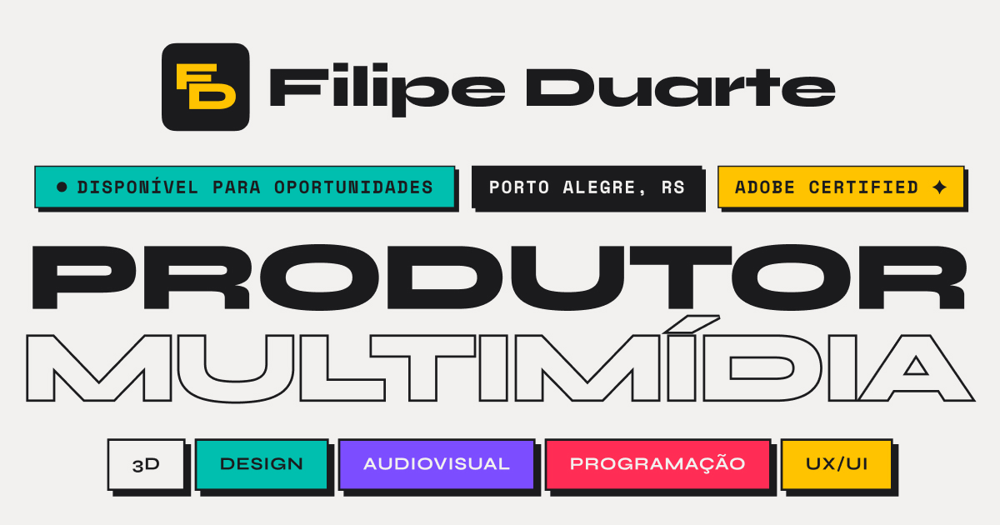
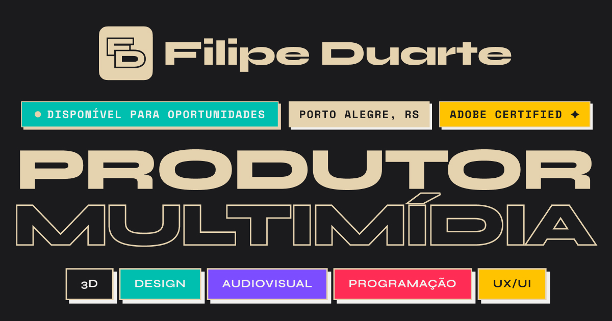

<div align="center">

# Filipe Duarte — Portfolio

[](https://astro.build)
[](https://filipeduarte.netlify.app)

<br/>

<table>
  <tr>
    <td></td>
    <td></td>
  </tr>
</table>

</div>

---

**PT** — Portfolio pessoal de Filipe Duarte, Diretor Criativo & Desenvolvedor. Estudos de caso de branding, motion design, desenvolvimento web e jogos — construídos com Astro, design Neo-Brutalista e atenção obsessiva aos detalhes.

**EN** — Personal portfolio of Filipe Duarte, Creative Director & Developer. Case studies on branding, motion design, web development and games — built with Astro, Neo-Brutalist design and obsessive attention to detail.

→ **[filipeduarte.netlify.app](https://filipeduarte.netlify.app)**

---

## Páginas / Pages

| Rota | PT | EN |
|------|----|----|
| `/` | Homepage | Homepage |
| `/projetos` | Grade de projetos | Projects grid |
| `/sobre` | Trajetória e carreira | About & career |
| `/criticas` | Críticas de filmes | Film reviews |
| `/kit` | Design system | Design system |

### Estudos de caso / Case studies

| Slug | Projeto |
|------|---------|
| `/projetos/mobi_studio` | Customizador interativo de capas (Canvas API) |
| `/projetos/mobi_3d` | Renders e animações 3D de produtos |
| `/projetos/mobi_estampas` | +70 estampas autorais |
| `/projetos/mobi_ric` | Identidade — Rap In Cena festival |
| `/projetos/mobi_alcas` | Campanha de alças |
| `/projetos/mobi_namorados` | Audiovisual — Dia dos Namorados |
| `/projetos/mobi_placas` | Gráficos para placas e carteiras |
| `/projetos/animas_cavalry` | 19 experimentos de motion procedural |
| `/projetos/cavaleiro_de_latao` | Jogo roguelike em Godot |
| `/projetos/unisenac_vivencias` | Identidade visual universitária |

---

## Stack

| Camada | Tecnologia |
|--------|-----------|
| Framework | [Astro](https://astro.build) 6.4.2 — output estático |
| Estilização | CSS3 puro com custom properties (Neo-Brutalista) |
| Interatividade | Vanilla JavaScript |
| Animações | Lottie.js + CSS transitions |
| Fontes | Self-hosted WOFF2 — Syne, Inter, Space Mono |
| Dados | JSON + CSV (integração Letterboxd) |
| Deploy | Netlify (Node 22) |

---

## Rodando localmente / Running locally

```bash
# instalar dependências
npm install

# servidor de desenvolvimento
npm run dev

# build de produção (minifica CSS + compila Astro)
npm run build

# preview do build estático
npm run preview
```

---

## Funcionalidades / Features

- **i18n PT/EN** — tradução client-side via atributos `data-en`
- **Dark mode** — tema completo via CSS custom properties
- **Cursor customizado** — 4 estados × 2 temas
- **Filtro de projetos** — por categoria, sem reload
- **Letterboxd** — RSS + CSV → JSON consolidado via script local
- **SEO** — JSON-LD, OG tags, canonical, sitemap, robots.txt
- **Performance** — fontes self-hosted, imagens WebP, CSS minificado

---

## Contato / Contact

<div>
  <a href="https://www.linkedin.com/in/filipe-velasco/" target="_blank">
    
  </a>
  &nbsp;
  <a href="mailto:filipe.velascoduarte@gmail.com">
    
  </a>
</div>

---

## Licença / License

**PT** — Este repositório é público para fins de visualização e referência. Todo o conteúdo (código, design, assets e estudos de caso) é de autoria de Filipe Duarte. Reprodução ou uso comercial sem autorização expressa é proibido.

**EN** — This repository is public for viewing and reference purposes only. All content (code, design, assets and case studies) is authored by Filipe Duarte. Reproduction or commercial use without explicit permission is prohibited.

© 2025 Filipe Duarte — Todos os direitos reservados / All rights reserved.
